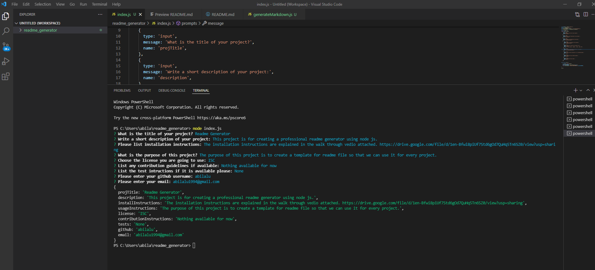

# readme_generator
## Description
* This project is to create a readme generator. I have used npm init and npm inquirer to add the package.jason and package-lock jason.
* The sample readme file generated is added to the sample readme folder in the repository. (https://github.com/abilalu/readme_generator/tree/main/sample_readme )
* A link for the walk through video is also attached the thereadme file to demonstrate how the prompts work.
### Screenshots

#### Walkthrough video
Link to the walk through demonstration video is : https://drive.google.com/file/d/1en-Bfwi8piUf7Std6gOd7QuHq5Tn6SZ0/view?usp=sharing

